# Full Stack E-Commerce Website

A full-stack e-commerce web application built using HTML, CSS, JavaScript, PHP and MySQL

## Features

- User registration and login
- Product listing
- Add to cart functionality
- Update cart quantity
- Checkout page
- Order success page
- Admin login
- Admin dashboard
- Add, edit, and delete products
- MySQL database integration

## Technologies Used

- HTML
- CSS
- JavaScript
- PHP
- MySQL
- XAMPP

## Project Folder Structure

- admin/ - Admin panel files
- css/ - Stylesheets
- images/ - Product and cart images
- includes/ - Database connection file
- pages/ - Login, register, cart, checkout pages
- index.php - Homepage

## How to Run This Project

1. Install XAMPP.
2. Start Apache and MySQL.
3. Copy the project folder into:

C:\xampp\htdocs\ecommerce

4. Import the database in phpMyAdmin.
5. Open the project in browser:

http://localhost/ecommerce/

## Screenshot

## Project Screenshots

### 1. Home Page
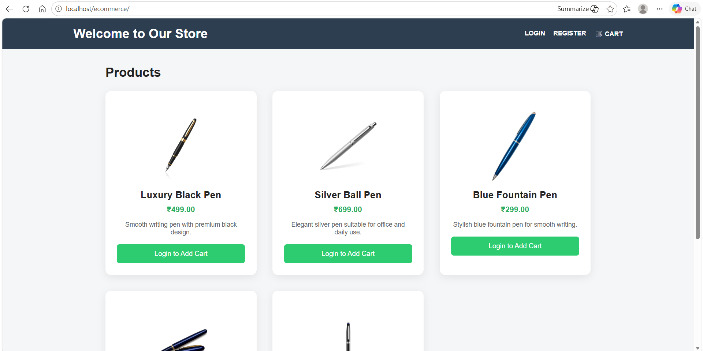

### 2. Register Page
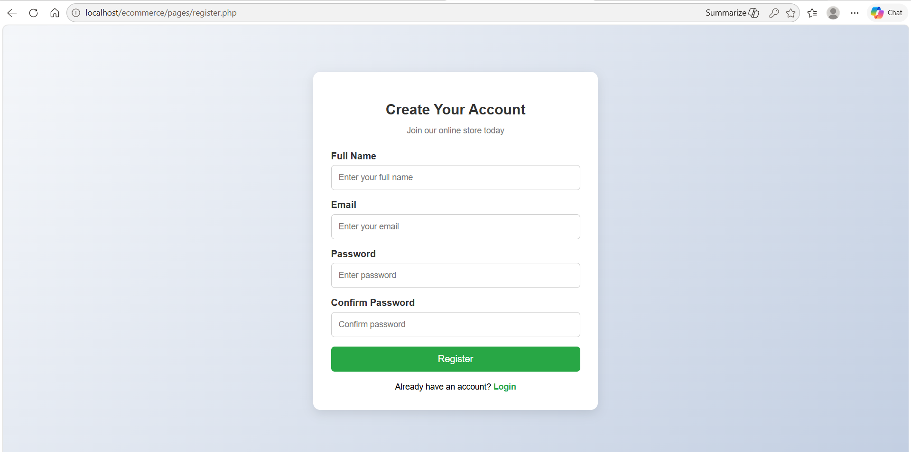

### 3. Login Page
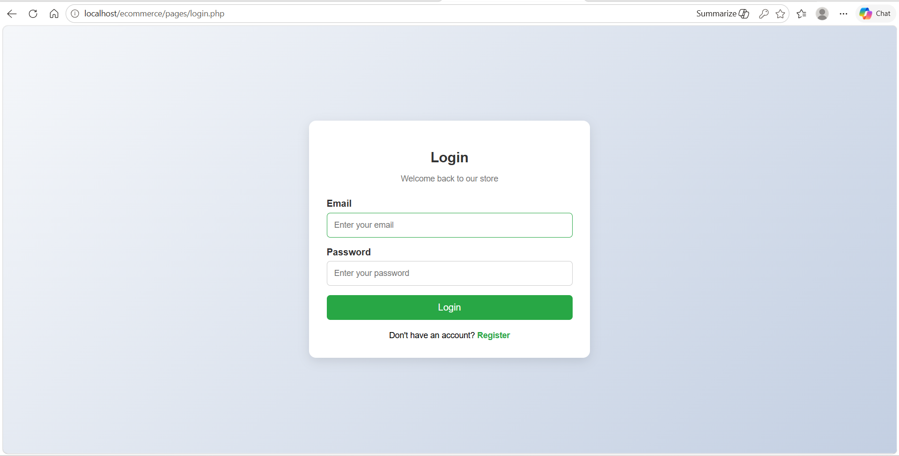

### 4. User Home Page
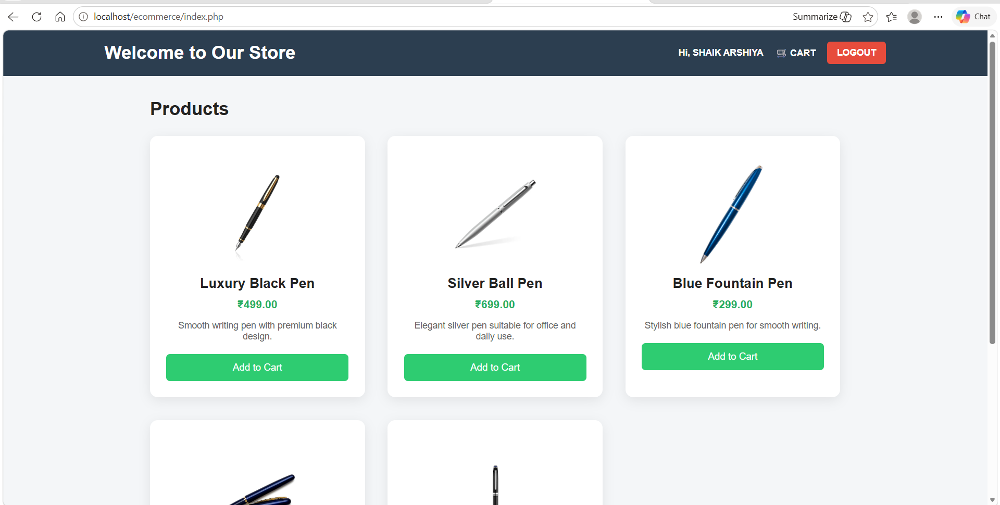

### 5. Cart Page
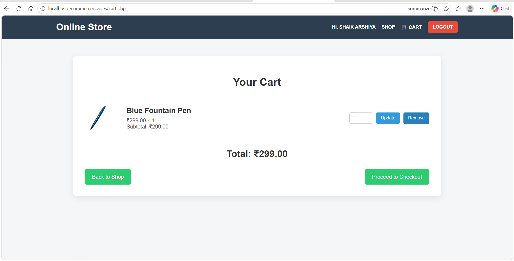

### 6. Checkout Page
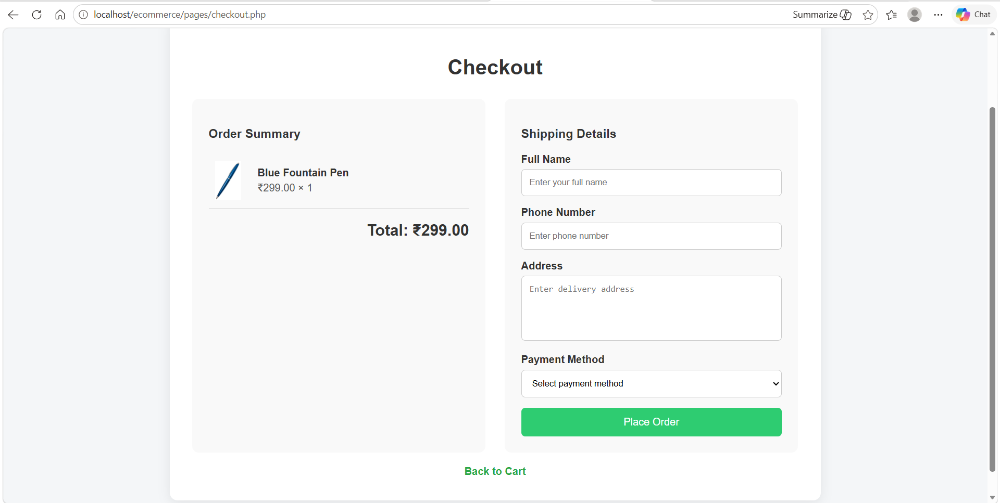

### 7. Order Success Page
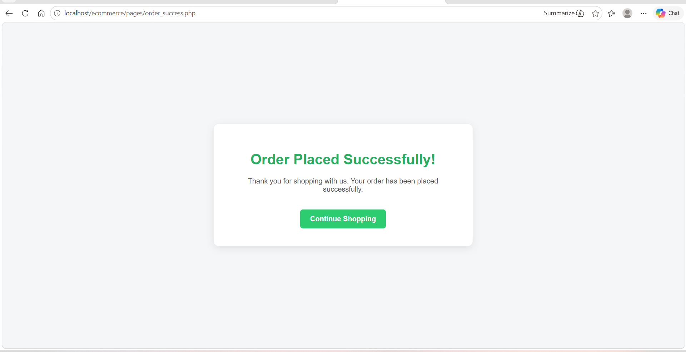

### 8. Admin Login Page
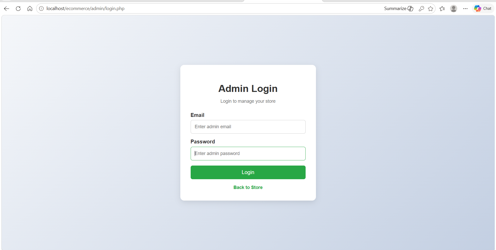

### 9. Admin Dashboard
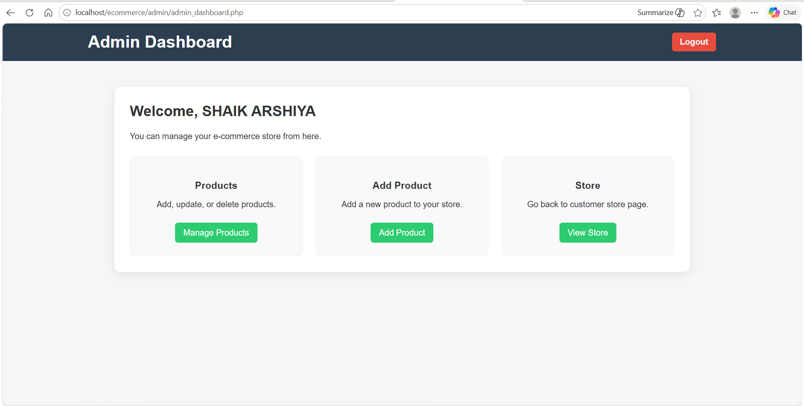

### 10. Manage Products Page
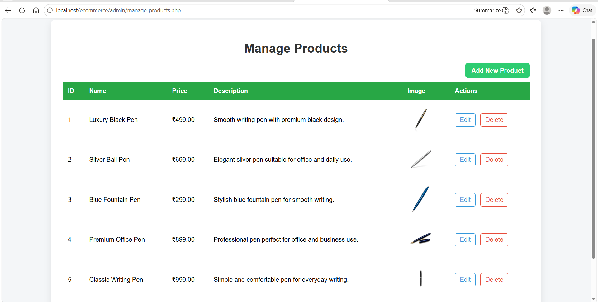

### 11. Add Product Page
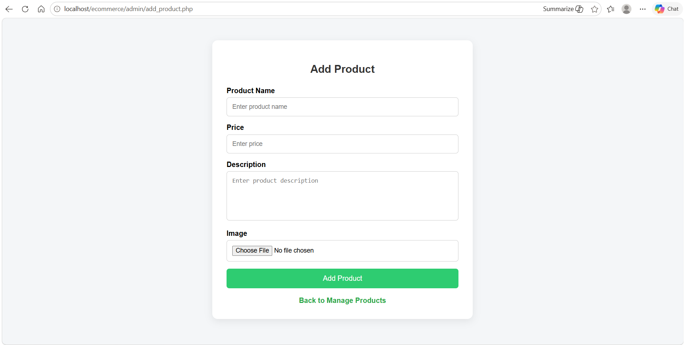

## Author

Arshiya Shaik
